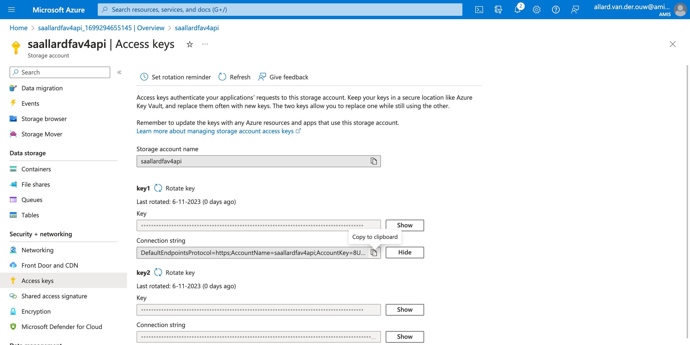

# Tutorial: Create a REST API with Azure Functions v4

In this tutorial we will create a simple CRUD REST API to manage 'things' with Azure Functions (v4) using TypeScript, VS Code and Azure Table Storage. I chose Azure Table Storage because this is one of the easiest ways to store data in Azure with low costs ([pricing details](https://azure.microsoft.com/en-us/pricing/details/storage/tables/)) compared to a database. If you do not want to use Azure Table Storage, then you can change the implementation of the function app to any kind of storage provider like an SQL database or Cosmos DB.

The steps in this tutorial are:

- [Step 1: Create resource group (optional)](#step-1-create-resource-group-optional)
- [Step 2: Create storage account](#step-2-create-storage-account)
- [Step 3: Create table in the storage account](#step-3-create-table-in-the-storage-account)
- [Step 4: Create function app](#step-4-create-function-app)
- [Step 5: Clone the example app with VS Code](#step-5-clone-the-example-app-with-vs-code)
- [Step 6: Deploy the example app to the function app](#step-6-deploy-the-example-app-to-the-function-app)
- [Step 7: Test the function app](#step-7-test-the-function-app)
  - [Get things](#get-things)
  - [Create a thing](#create-a-thing)
  - [Get things (again)](#get-things-again)
  - [Get a single thing](#get-a-single-thing)
  - [Update a thing](#update-a-thing)
  - [Delete a thing](#delete-a-thing)
- [Step 8: Celebrate](#step-8-celebrate)
- [Step 9: Clear resources (optional)](#step-9-clear-resources-optional)

## Step 1: Create resource group (optional)

If you do not have a resource group yet or want to clear the resources of this tutorial easily, then creating a resource group is needed.

- In the Azure portal, navigate to `Resource groups`
- In the top left, click on the `Create` button
- In the `Basics` tab, enter:
  - Resource group: `<your resource group>`
  - Region: `<your region>`
  - Click `Review + create`
- In the `Review` tab, click on `Create`

## Step 2: Create storage account

In this step we will create the storage account for the storage table and copy the connection string for step 4.

**Create storage account:**

- In the Azure portal, navigate to `Storage accounts`
  
- In the top left, click on the `Create` button
- In the `Basics` tab, enter:
  - Resource group: `<your resource group>`
  - Storage account `<any name>`
  - Region: `<your region>`
  - Performance: `Standard` (default)
  - Redundancy: `Locally-redundant storage (LRS)`
  - Click `Review` on the bottom left
- In the `Review` tab, wait for validation, then click on `Create`

Your storage account will now be created. This can take a moment.

After the deployment is completed, click on `Go to resource`.


**Copy connection string:**

- On the left, click on `Access keys`
- Under `key1`, click on `Show` after the Connection string
- Click the small `Copy to clipboard` button and save the string to a text file for the configuration of the function app in step 4, the connection string starts with `DefaultEndpointsProtocol=https;AccountName=`



## Step 3: Create table in the storage account

In this step we will create the table to store the data.

- If you came here from step 1, then proceed to the next bullet, else in the Azure portal, navigate to `Storage browser` and click on the previously created storage account
- On the left, click on `Tables`
- Click on `Add table`
- In the dialog, enter `things` and click on `Ok`


Your table is now created and ready for some things.

## Step 4: Create function app

In this step we will create and configure the function app.

**Create function app:**

- In the Azure portal, navigate to `Function App`
  
- In the top left, click on the `Create` button
- In the `Basics` tab, enter:
  - Resource Group: `<your resource group>`
  - Function App name `<any name>`
  - Runtime stack: `Node.js`
  - Version: `18 LTS` (default)
  - Region: `<your region>`
  - Operating System: `Linux`
  - Hosting options and plans: `Consumption` (default)
  - Click `Review + create`
- In the `Review` tab, wait for validation, then click on `Create`

Your function app will now be created. This can take a moment.

After the deployment is completed, click on `Go to resource`.


**Configure function app:**

- On the left, click on `Configuration` under `Settings`
- Under `Application settings`, click on `New application setting`
  - Name: `DATA_TABLE_CONNECTION_STRING`
  - Value: `<the storage account connection string from step 2>`
  - Click `Ok`
- Click `New application setting` again
  - Name: `DATA_TABLE_NAME`
  - Value: `things`
  - Click `Ok`
- On the top bar, click on `Save`
- Click `Continue` in the confirmation dialog to save the changes


## Step 5: Clone the example app with VS Code

In this step we clone the example app to VS Code. Copy the string below.

```
https://github.com/allardvanderouw/azure-function-app-rest-example.git
```

This is a modified version of the "Create Function" code of the "Azure Functions" VS Code extension.

- In VS Code, click on `Source Control` in the left menu bar
- Click on `Clone Repository`
- Paste the GitHub string
- Press Enter and select a destination folder

You have now cloned the example app to your local environment.

The folder structure is:

```
<project_root>/
 | - .vscode/
 | - dist/
 | - node_modules/
 | - src/
 | | - common/
 | | | - tableClient.ts
 | | - functions/
 | | | - createThing.ts
 | | | - deleteThing.ts
 | | | - getThing.ts
 | | | - getThings.ts
 | | | - updateThing.ts
 | | - index.ts
 | - .funcignore
 | - .gitignore
 | - host.json
 | - package-lock.json
 | - package.json
 | - README.json
 | - tsconfig.json
```

The `functions` folder contains all the function files which contain the logic behind the functions, like the interaction with the table storage.

The `src/index.ts` file contains the function app routes:

```typescript
import { app } from "@azure/functions";
import { createThing } from "./functions/createThing";
import { deleteThing } from "./functions/deleteThing";
import { getThing } from "./functions/getThing";
import { getThings } from "./functions/getThings";
import { updateThing } from "./functions/updateThing";

app.http("getThings", {
  methods: ["GET"],
  authLevel: "anonymous",
  route: "things",
  handler: getThings,
});

app.http("createThing", {
  methods: ["POST"],
  authLevel: "anonymous",
  route: "things",
  handler: createThing,
});

app.http("getThing", {
  methods: ["GET"],
  authLevel: "anonymous",
  route: "things/{id}",
  handler: getThing,
});

app.http("updateThing", {
  methods: ["PUT"],
  authLevel: "anonymous",
  route: "things/{id}",
  handler: updateThing,
});

app.http("deleteThing", {
  methods: ["DELETE"],
  authLevel: "anonymous",
  route: "things/{id}",
  handler: deleteThing,
});
```

This way of the defining the functions is the main difference compared to Azure Functions v3.

Now we will deploy the app to the created function app.

## Step 6: Deploy the example app to the function app

In this step we will deploy the example app to Azure.

**Setup VS Code for Azure**:

In VS Code, click on `Extensions` in the left menu bar. Install the following Microsoft extensions:

- Azure Account
- Azure Functions
- Azure Resources

**Sign in to Azure:**

After installing these extensions, there should be an Azure button in the left bar. Click on it.

Then click on `Sign in to Azure...`. This should open a browser which prompts you to sign in to Azure. Sign in and close the window.


On the left, you should now see your Azure resources.

**Deploy function app:**

- On the bottom left of the Azure tab, there should be a workspace with a tiny Function App logo when you move the mouse on the workspace bar, click on that icon
  
- Click on `Deploy to function app...`
- In the top center, a small dialog appears showing 'Loading...'
- After loading is completed, select the function app which you have created earlier, then press `Enter`
  
- A dialog appears to confirm overwrite, press `Deploy`
- The deployment has started and should finish successfully, then click on `Show output` on the bottom right

The output should show something like:


These are the URL's which are now available. Great, time for some actual testing.

## Step 7: Test the function app

So everything is ready to go now. Time to get things going.

To test the function app easily, an API client like Postman is suggested.

### Get things

Request URL:

```
GET https://<your function app name>.azurewebsites.net/api/things
```

Response body:

```json
[]
```

Makes sense, because we haven't created any things yet.

### Create a thing

Request URL:

```
POST https://<your function app name>.azurewebsites.net/api/things
```

Request body:

```json
{
  "name": "Special thing",
  "description": "This is a special thing..."
}
```

Click `Send` to create the first thing.


Create another one:

Request body:

```json
{
  "name": "Another special thing",
  "description": "This is another special thing..."
}
```

### Get things (again)

Request URL:

```
GET https://<your function app name>.azurewebsites.net/api/things
```

(if you are using Postman, make sure the body is set to `none` on GET requests, else an error is shown)

Response body:

```json
[
  {
    "etag": "W/\"datetime'2023-10-22T13%3A39%3A59.1889147Z'\"",
    "partitionKey": "71d5adad-c8b7-4ef3-8ab2-2d82eaacbf69",
    "rowKey": "71d5adad-c8b7-4ef3-8ab2-2d82eaacbf69",
    "timestamp": "2023-10-22T13:39:59.1889147Z",
    "id": "71d5adad-c8b7-4ef3-8ab2-2d82eaacbf69",
    "name": "Another special thing",
    "description": "This is another special thing..."
  },
  {
    "etag": "W/\"datetime'2023-10-22T13%3A39%3A55.7808569Z'\"",
    "partitionKey": "8bad0780-4f03-4db7-a681-910cfea05c2c",
    "rowKey": "8bad0780-4f03-4db7-a681-910cfea05c2c",
    "timestamp": "2023-10-22T13:39:55.7808569Z",
    "id": "8bad0780-4f03-4db7-a681-910cfea05c2c",
    "name": "Special thing",
    "description": "This is a special thing..."
  }
]
```

In Azure you can also see the two things in the storage browser:


### Get a single thing

Request URL:

```
GET https://<your function app name>.azurewebsites.net/api/things/71d5adad-c8b7-4ef3-8ab2-2d82eaacbf69
```

Response body:

```json
{
  "odata.metadata": "https://saallardvanderouw.table.core.windows.net/$metadata#things/@Element",
  "etag": "W/\"datetime'2023-10-22T13%3A39%3A59.1889147Z'\"",
  "partitionKey": "71d5adad-c8b7-4ef3-8ab2-2d82eaacbf69",
  "rowKey": "71d5adad-c8b7-4ef3-8ab2-2d82eaacbf69",
  "timestamp": "2023-10-22T13:39:59.1889147Z",
  "id": "71d5adad-c8b7-4ef3-8ab2-2d82eaacbf69",
  "name": "Another special thing",
  "description": "This is another special thing..."
}
```

### Update a thing

Request URL:

```
PUT https://<your function app name>.azurewebsites.net/api/things/71d5adad-c8b7-4ef3-8ab2-2d82eaacbf69
```

Request body:

```json
{
  "name": "Modified special thing",
  "description": "This is modified special thing..."
}
```

Response body:

```json
{
  "partitionKey": "71d5adad-c8b7-4ef3-8ab2-2d82eaacbf69",
  "rowKey": "71d5adad-c8b7-4ef3-8ab2-2d82eaacbf69",
  "name": "Modified special thing",
  "description": "This is modified special thing..."
}
```

The thing is now modified. You can review this through a GET request or with the storage browser.

### Delete a thing

Request URL:

```
DELETE https://<your function app name>.azurewebsites.net/api/things/71d5adad-c8b7-4ef3-8ab2-2d82eaacbf69
```

Response:

```
204 No Content
```

The thing is now deleted. You can review this through a GET request or with the storage browser.

## Step 8: Celebrate

If you got here without any (big) issues. Then it is time to celebrate to completion of this tutorial!

🎂 🎉 🥳

## Step 9: Clear resources (optional)

- In the Azure portal, navigate to `Resource groups`
- If you created a fresh resource group, you can simply delete the resource group from here
- Else you can clear the newly created resources, see the image below for the resources which are created during this tutorial


